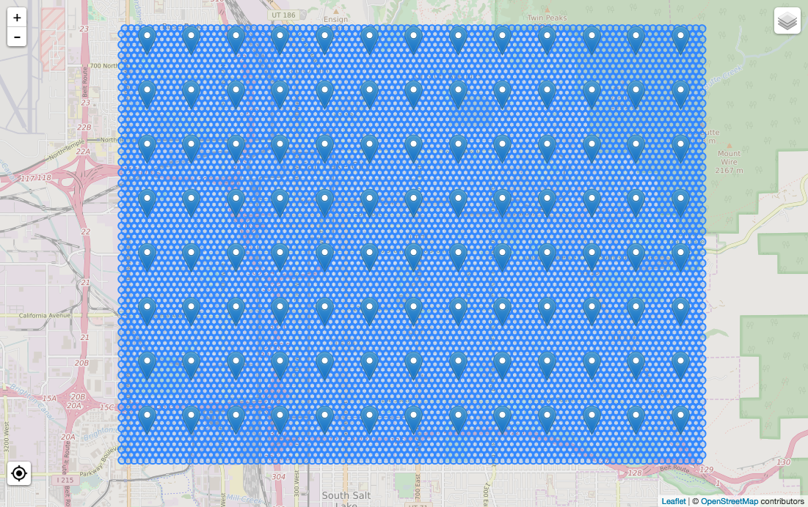

# pokeminer+

A Pokémon Go scraper capable of scanning large area for Pokémon spawns over long period of time. Suitable for gathering data for further analysis.

## Oh great, another map?

This is not *a map*, a map is included, but the main goal of this app is to *gather data* and put it in a database for further analysis.

## How does it work?

`worker.py` gets a rectangle from start/end coordinates (configured in `config.py`) and spawns *n* workers. Each of the workers use different accounts to scan their surrounding areas for Pokemon. To put it simply: **you can scan an entire city for Pokemon**. All gathered information is put into a database for further analysis. `worker.py` is fully threaded and logs in again after *X* scans just to make sure the connection with the server is in a good state. It's also capable of restarting workers that are misbehaving, so that the data-gathering process is uninterrupted.

There's also a simple interface that displays active Pokemon on a map, and can generate nice-looking reports.

Here it is in action:


And here are workers together with their area of scan:



## Features

- multithreaded, multiple accounts at the same time
- aims at being very stable for long-term runs
- able to map entire city (or larger area) in real time
- gathers Pokémon and Gyms and stores in database
- visualization
- reports for gathered data

## Setting up

[/u/gprez](https://www.reddit.com/u/gprez) made [a great tutorial on Reddit](https://www.reddit.com/r/pokemongodev/comments/4tz66s/pokeminer_your_individual_pokemon_locations/d5lovb6). Check it out if you're not familiar with Python applications or databases.

**Note**: Pokeminer works with Python 3.5 only. Python 2.7 is **not supported** and is not compatible at all since I moved from threads to coroutines. Seriously, it's 2016, Python 2.7 hasn't been developed for 6 years, why don't you upgrade already?

Create the database by running Python interpreter. Note that if you want more than 10 workers simultaneously running, SQLite is probably not the best choice.

```
$ python
>>> import db
>>> db.Base.metadata.create_all(db.get_engine())
```

Copy `config.py.example` to `config.py` and modify as you wish. See [wiki page](https://github.com/modrzew/pokeminer/wiki/Config) for explanation on properties.

Run the worker:

```
python worker.py
```

Optionally run the live map interface and reporting system:

```
python web.py --host 127.0.0.1 --port 8000
```

### How many workers do I need?

**tl;dr**: about 1.2 workers per km².

Longer version: there's a set delay between each scan, and one spawn lasts for at least 15 minutes; so to avoid missing spawns there is a limit to the PPC (points per cycle) each worker can be assigned. As I'm writing this the scan delay is set to 10, so combining that with 15-minute spawn times gives a maximum of **90 PPC**. You can check that value in worker.py's status window.

And how many workers do you need? Let's calculate that for a hexagonal grid:

```
overlap_area = (pi - 3/2*sqrt(3) *2) * 2
overlap_correction_factor ≈ 1.17
```

Results:

```
number_of_workers = (π * radius²) /( π * 70m²) * 1.17 * 10s / (15*60s) = (radius_in_km)² * 2.65
```

For example, a radius of 5.5km is around 95km² and with the formula above would be ~80 workers.

Credits go to [Aiyubi](https://github.com/Aiyubi) who did the [original math](https://github.com/modrzew/pokeminer/issues/124). Thanks!

## Reports

There are three reports, all available as web pages on the same server as the live map:

1. Overall report, available at `/report`
2. Single species report, available at `/report/<pokemon_id>`
3. Gym statistics page, available by running `gyms.py`

Here's what the overall report looks like:

[](static/demo/report.png)

The gyms statistics server is in a separate file, because it's intended to be shared publicly as a webpage.

[](static/demo/gyms.png)

## License

See [LICENSE](LICENSE).

This project is based on the coroutines branch of [pokeminer](https://github.com/modrzew/pokeminer/tree/coroutines). Pokeminer was originally based on an early version of [PokemonGo-Map](https://github.com/AHAAAAAAA/PokemonGo-Map), but no longer shares any code with it. It currently uses [pgoapi](https://github.com/pogodevorg/pgoapi).
