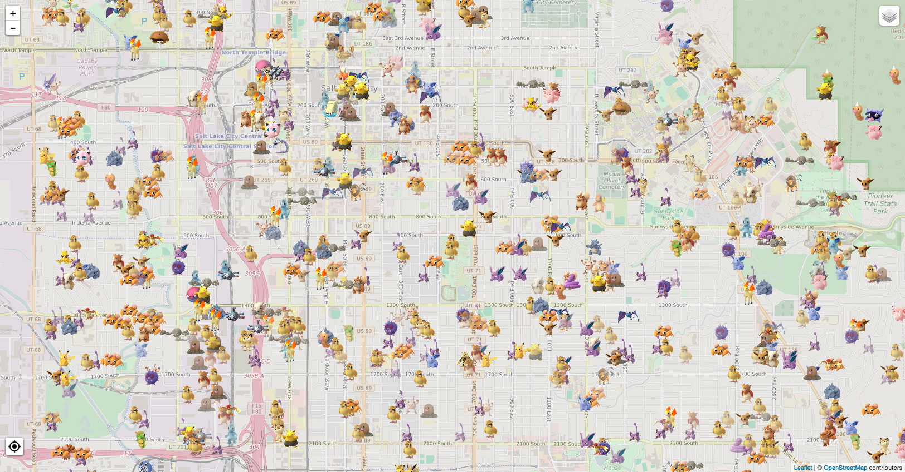

# pokeminer+

A Pokémon Go scraper capable of scanning large areas for Pokémon spawns over long periods of time. Features spawnpoint scanning, Twitter and PushBullet notifications, accurate expiration times and estimates based on historical data, pokestop and gym collection, a CAPTCHA solving script, and more.

[A demonstration of the Twitter notifications can be viewed here](https://twitter.com/SLCPokemon).

## How does it work?

It uses a database table of spawnpoints and expiration times to visit points soon after Pokemon spawn. For each point it determines which eligible worker can reach the point with the lowest speed, or tries again if all workers would be over the configurable speed limit. This method scans very efficiently and finds Pokemon very soon after they spawn, and also leads to unpredictable worker movements that look less robotic. The spawnpoint database continually expands as Pokemon are discovered. If you don't have enough accounts to keep up with the number of spawns in your database, it will automatically skip points that are unreachable within the speed limit or points that it has already seen spawn that cycle from other nearby points.

If you don't have an existing database of spawn points it will spread your workers out over the area you specify in config and collect the locations of spawn points from GetMapObjects requests. It will then visit those points whenever it doesn't have a known spawn (with its expiration time) to visit soon. So it will gradually learn the expiration times of more and more spawn points as you use it.

There's also a simple interface that displays active Pokemon on a map, and can generate nice-looking reports.

Here it is in action:

Since it uses [Leaflet](http://leafletjs.com/) for mapping, the appearance and data source can easily be configured to match [any of these](https://leaflet-extras.github.io/leaflet-providers/preview/) with the `MAP_PROVIDER_URL` config option.

## Features

- accurate timestamp information whenever possible with historical data
- Twitter and PushBullet notifications
  - references nearest landmark from your own list
- IV/moves detection, storage, and notification
  - produces nice image of Pokémon with stats for Twitter
  - can configure to get IVs for all Pokémon or only those eligible for notification
- stores Pokémon, gyms, and pokestops in database
- spawnpoint scanning with or without an existing database of spawns
- automatic account swapping for CAPTCHAs and other problems
- pickle storage to improve speed and reduce database queries
- manual CAPTCHA solving that instantly puts accounts back in rotation
- closely emulates the client to reduce CAPTCHAs and bans
- automatic device_info generation and retention
- aims at being very stable for long-term runs
- able to map entire city (or larger area) in real time
- reports for gathered data
- asyncio coroutines
- support for Bossland's hashing server
  - displays key usage stats in real time

## Setting up
1. Install Python 3.5 or later (3.6 is recommended)
2. `git clone https://github.com/Noctem/pokeminer.git` or download the [zip](https://github.com/Noctem/pokeminer/archive/develop.zip)
3. Copy `config.example.py` to `config.py` and customize it with your accounts, location, database information, and any other relevant settings. The comments in the config example provide some information about the options.
4. `pip3 install -r requirements.txt`
  * Optionally `pip3 install` additional packages listed in optional-requirements
    * *pushbullet.py* is required for pushbullet notifications
    * *python-twitter* is required for twitter notifications
    * *stem* is required for proxy circuit swapping
    * *shapely* is required for landmarks or spawnpoint scan boundaries
    * *selenium* (and [ChromeDriver](https://sites.google.com/a/chromium.org/chromedriver/)) are required for solving CAPTCHAs
    * *uvloop* provides better event loop performance
    * *pycairo* is required for generating IV/move images
    * *mysqlclient* is required for using a MySQL database
    * *psycopg2* is required for using a PostgreSQL database
    * *requests* is required for using webhooks
    * *aiosocks* is required for using SOCKS proxies
    * *cchardet* and *aiodns* provide better performance with aiohttp
    * *numba* provides better performance through JIT compilation
5. Run `python3` from the command line
  1. Input `import db`
  2. then `db.Base.metadata.create_all(db.get_engine())`
6. Run `scan.py`
  * Optionally run the live map interface and reporting system: `web.py`

**Note**: Pokeminer works with Python 3.5 or later only. Python 2.7 is **not supported** and is not compatible at all since I moved from threads to coroutines. Seriously, it's 2016, Python 2.7 hasn't been developed for 6 years, why don't you upgrade already?

Note that if you want more than 10 workers simultaneously running, SQLite is likely not the best choice. I personally use and recommend PostgreSQL, but MySQL and SQLite should also work.

## Reports

There are three reports, all available as web pages on the same server as the live map:

1. Overall report, available at `/report`
2. Single species report, available at `/report/<pokemon_id>`
3. Gym statistics page, available by running `gyms.py`

The workers' live locations and stats can be viewed from the main map by enabling the workers layer, or at `/workers` (communicates directly with the worker process and requires no DB queries).

Here's what the overall report looks like:

The gyms statistics server is in a separate file, because it's intended to be shared publicly as a webpage.

## License

See [LICENSE](LICENSE).

This project is based on the coroutines branch of (now discontinued) [pokeminer](https://github.com/modrzew/pokeminer/tree/coroutines). Pokeminer was originally based on an early version of [PokemonGo-Map](https://github.com/AHAAAAAAA/PokemonGo-Map), but no longer shares any code with it. It currently uses my lightly modified fork of [pgoapi](https://github.com/Noctem/pgoapi).
